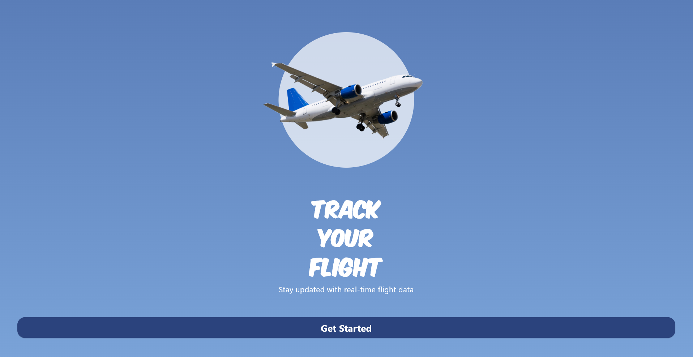
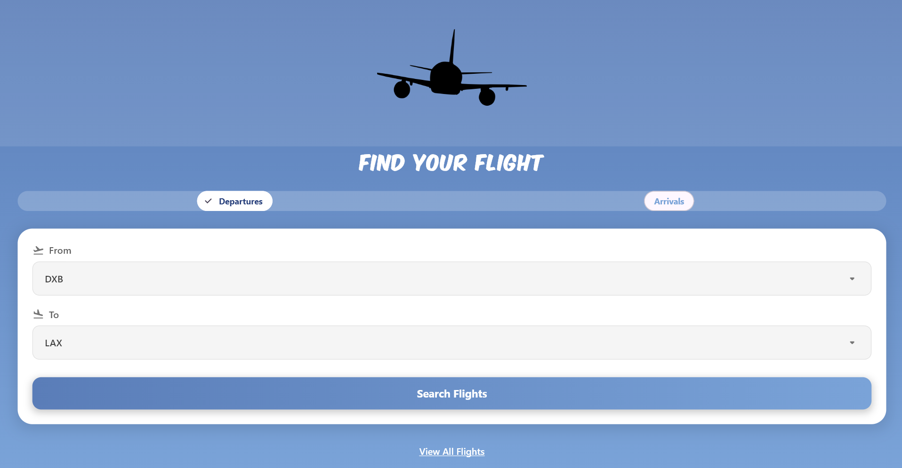
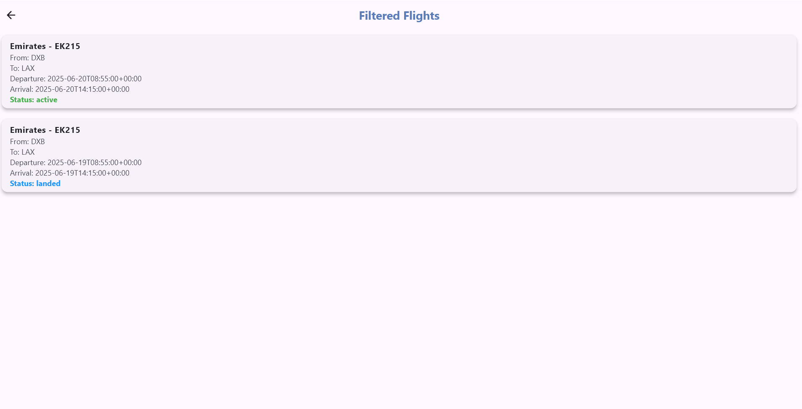
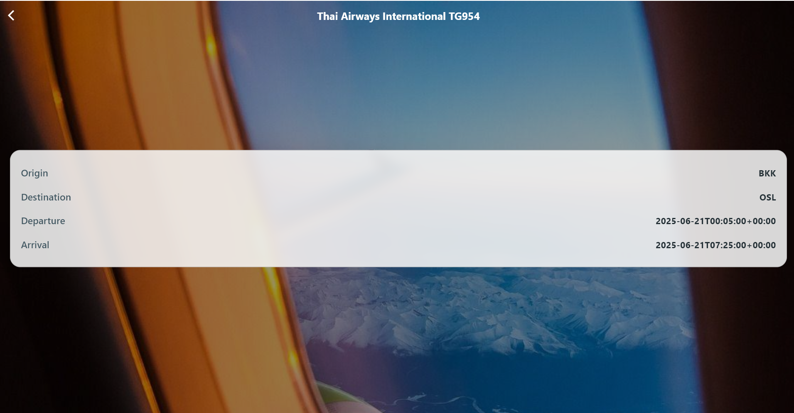
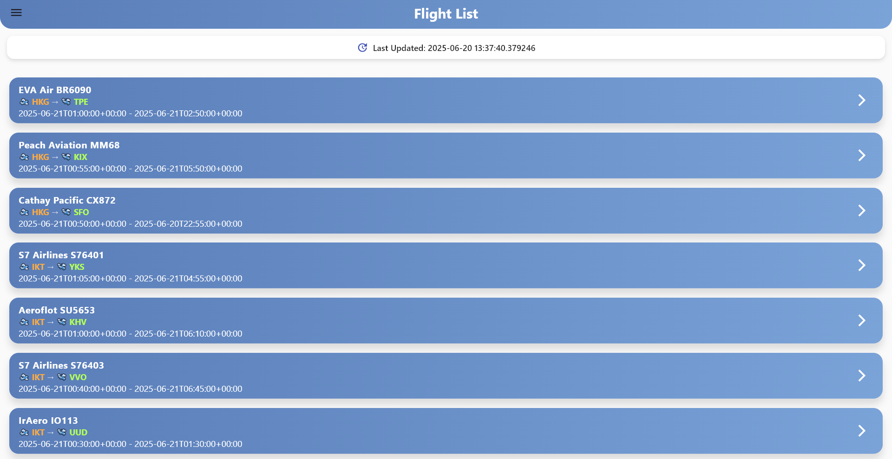
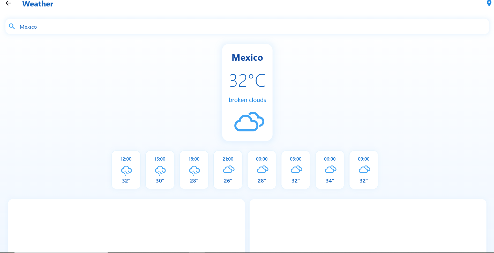

# ✈️ Flight Tracker App – Made with Flutter 💙

Welcome to **Flight Tracker**, a beautiful and functional mobile app built with Flutter!  
Easily track **live flight arrivals, departures, delays**, and even get the **current weather** at your airport of choice!  
Powered by the [AviationStack API](https://aviationstack.com/).

---

## 📸 Sneak Peek – Screenshots

| Welcome | Home | Filtered |
|--------|------|----------|
|  |  |  |

| Details | List | Weather |
|--------|------|----------|
|  |  |  |

---

## ✨ Features You’ll Love

- 📡 **Live Flight Data** – Real-time arrivals, departures & delays
- 🔍 **Smart Filters** – View by airport, status, and more
- 🌤️ **Weather Reports** – Get live weather at airport locations
- 📱 **Sleek UI** – Clean, responsive design that’s easy to navigate
- 🧪 **Built-In Testing** – Flutter test suite for key components

---

## 🛠️ Tech Stack

| 🧩 Tool | 📋 Description |
|--------|----------------|
| **Flutter & Dart** | UI toolkit & language |
| **REST API** | AviationStack for real-time flight info |
| **State Management** | SetState + Provider (or your preferred method) |
| **Testing** | Flutter test framework |

---
🔐 To run this app, create a `lib/utils/constants.dart` file with your AviationStack API key:

```dart
const String baseUrl = 'http://api.aviationstack.com/v1';
const String apiKey = 'YOUR_REAL_API_KEY';
